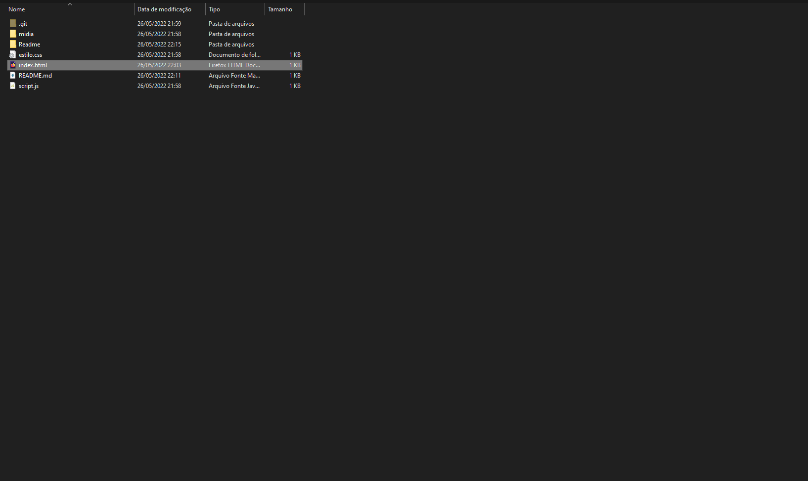
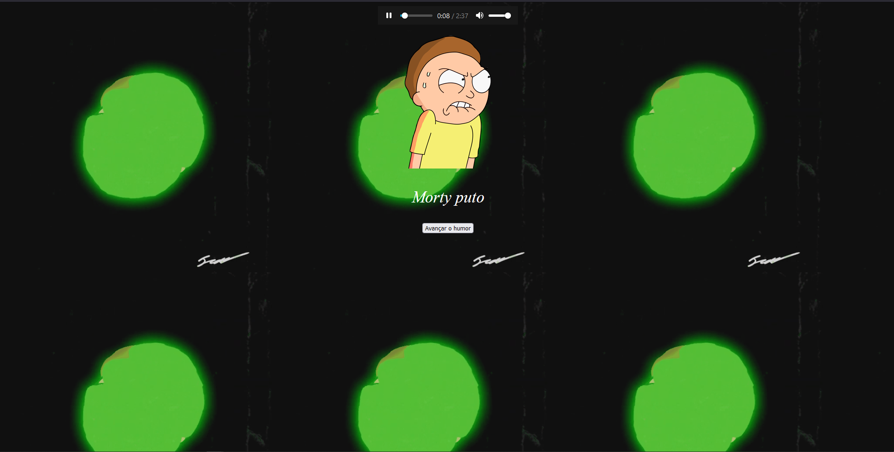

<h1 align="center"> ⚡ Projeto jogo do humor ⚡ </h1>

## Git pages do projeto

### https://rafaelmasselli.github.io/FrontEnd-JogoDoHumor/

## Descrição

### Projeto feito com <a href="https://developer.mozilla.org/pt-BR/docs/Web/HTML">Html</a> e <a href="https://developer.mozilla.org/pt-BR/docs/Web/CSS">Css </a> simples com conteiner responsivo, usando um <a href="https://developer.mozilla.org/pt-BR/docs/Web/JavaScript">script.js</a> para mudar as imagens de humor

<div align="center">
   
</div>

## Requisitos

### Para iniciar o projeto você ira precisa do <a href="https://git-scm.com/downloads">git</a>

## Clonando o projeto,em qualquer terminal clone o projeto

```
git clone https://github.com/rafaelmasselli/FrontEnd-JogoDoHumor
```

## Inicializando o projeto

> Entre na pasta do projeto

> Aperte no index.html



>  E assim ira abrir o projeto




## Ferramentas de aprendizado

### Introducao a html css e scripts web 


